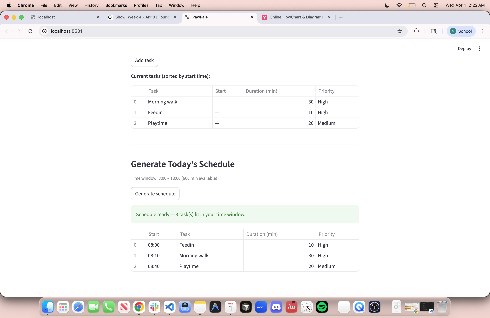

# PawPal+

A pet care scheduler built with Python and Streamlit. Enter your tasks, set your available hours, and get a prioritized daily plan — with automatic conflict warnings.

---

## Features

- **Priority sorting** — tasks are ordered high → medium → low; ties broken by shortest duration first.
- **Chronological start times** — each scheduled task gets a real `HH:MM` stamp; manually pre-assigned times are preserved.
- **Daily recurrence** — completing a `daily` or `weekly` task auto-creates the next occurrence using `timedelta`.
- **Conflict detection** — `detect_conflicts()` flags any two tasks whose time windows overlap and names them both.
- **Time-budget enforcement** — tasks that don't fit are surfaced in a "Skipped" list, not silently dropped.

---

## Setup

```bash
python -m venv .venv
source .venv/bin/activate   # Windows: .venv\Scripts\activate
pip install -r requirements.txt
streamlit run app.py
```

---

## Testing

```bash
python -m pytest tests/test_pawpal.py -v
```

- **Sorting** — I am testing whether tasks come back in chronological order and whether untimed tasks go last.
- **Recurrence** — I am testing whether completing a daily task adds a follow-up due the next day.
- **Conflict detection** — I am testing whether overlapping tasks are flagged and sequential tasks are not.

**Confidence: 4 / 5 stars** — core behaviors are covered; `generate_schedule()` end-to-end and weekly recurrence still need tests.

---

## System design

Class diagram: [uml_final.png](uml_final.png)

| Class | Responsibility |
|---|---|
| `Task` | Data + `mark_complete()` + `next_occurrence()` |
| `Pet` | Owns the task list |
| `Owner` | Stores the time window |
| `Scheduler` | Sorts, schedules, detects conflicts, explains the plan |

---

## 📸 Demo

<a href="Screenshot.png" target="_blank"></a>
